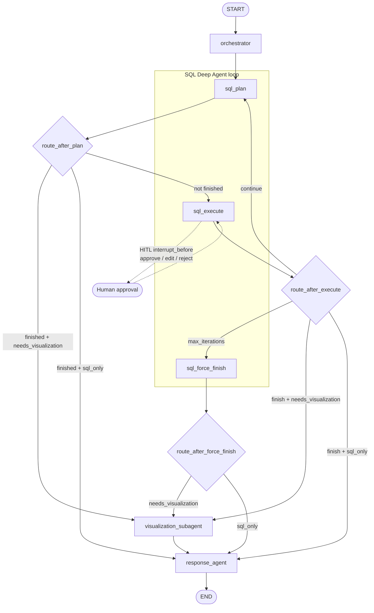

# How a Query Flows Through the LangGraph Workflow

This document explains the LangGraph defined in `graph/workflow.py`: how a
natural-language question moves from `START` to `END`, including the SQL
deep-agent loop and the optional visualisation branch.

## Problem statement

Manufacturing companies sit on rich operational data — plants, production
runs, defect rates, maintenance costs, inventory, suppliers — but most of
that value is locked behind SQL, BI tools, and specialist analysts.

Typical pain points:

- **Slow answers.** A plant manager asking “which line has the worst
  downtime this quarter?” waits for an analyst to write queries, pull
  numbers, and maybe build a chart.
- **High barrier to data.** Operators and supervisors who know the
  business rarely know the schema; they cannot self-serve safely.
- **Risky ad-hoc SQL.** Unreviewed queries can be wrong, expensive, or
  (in less locked-down systems) destructive.
- **Fragmented insights.** Numbers live in one place, charts in another,
  and the narrative for leadership is assembled by hand.

The result: decisions lag, tribal knowledge stays tribal, and the
warehouse of manufacturing data under-delivers.

## How this project helps

This system is a **multi-agent analytics assistant** for a fictional firm
(“Northbridge Precision Manufacturing”) that demonstrates how a company
can turn operational SQLite data into grounded answers — in plain English,
with optional charts, under human control.

| Company need | How the project addresses it |
|---|---|
| Ask questions in natural language | Orchestrator + SQL deep agent turn the question into read-only SQL against production/quality/maintenance/inventory tables |
| Trust the numbers | Every generated query can pause for **human approve / edit / reject** before it hits the database |
| See the story, not just rows | Response agent synthesizes a manager-ready answer from query results |
| Spot patterns quickly | Visualisation subagent builds a chart when the question implies comparison, trend, or ranking |
| Keep the warehouse safe | SQL tool allows **SELECT only**; no writes or DDL |
| Scale specialist expertise | Agent “skills” encode analyst procedures (routing, SQL looping, charting, synthesis) so the same playbook runs consistently |

In short: it shortens the path from **business question → trusted answer
(+ chart)** for manufacturing ops, while keeping a human in the loop and
the data store read-only.

> **Note:** All company data here is synthetic (seeded via Faker). The
> architecture is what would plug into a real manufacturing warehouse or
> replica database.

---

## Mermaid diagram



Nodes match `build_graph()` in `graph/workflow.py`. The dashed HITL edge is
not a graph edge — it is `interrupt_before=["sql_execute"]` when
`HUMAN_IN_THE_LOOP_ENABLED` is true, handled by `main.py`.

## High-level path

```
user question
  → orchestrator          (route: sql_only | sql_and_visualization)
  → sql_plan              (propose SQL or finish)
  → [HITL pause]          (optional, before every sql_execute)
  → sql_execute           (run approved SELECT)
  → loop back to sql_plan OR exit the deep agent
  → visualization_subagent (only if needs_visualization)
  → response_agent
  → final_answer
```

Every question always goes through the orchestrator and the SQL deep agent.
Visualisation is conditional. The response agent is always last.

## Step-by-step flow

### 1. Entry — `main.py` builds state and invokes the app

`run_query()` creates a fresh `thread_id`, builds `AgentState` via
`initial_state(user_query)`, and calls `app.invoke(...)`. The compiled app
uses a SQLite checkpointer (`database/checkpoints.db`) so a paused run can
resume after human approval.

### 2. `orchestrator`

- Reads `user_query`.
- LLM returns JSON: `{"route": "sql_only" | "sql_and_visualization", "reason": "..."}`.
- Writes to state:
  - `route`
  - `needs_visualization` (`True` only for `sql_and_visualization`)
  - appends the user message to `messages`

Always edges to `sql_plan` — routing does not skip SQL.

### 3. `sql_plan` (plan / reflect)

- Builds a prompt with the live DB schema and conversation so far.
- LLM responds with either:
  - `{"action": "query", "sql_query": "...", "thought": "..."}` → sets
    `sql_query`, resets `sql_query_approved=False`, keeps looping
  - `{"action": "final", "summary": "..."}` → sets `sql_agent_finished=True`
    and `sql_summary`

Then `route_after_plan` decides:

| Condition | Next node |
|---|---|
| `sql_agent_finished` is false | `sql_execute` |
| finished and `needs_visualization` | `visualization_subagent` |
| finished and not visualizing | `response_agent` |

### 4. Human-in-the-loop (before `sql_execute`)

When HITL is enabled, the graph **pauses before** `sql_execute`. `main.py`
shows `sql_query` and asks approve / edit / reject:

- **approve** — sets `sql_query_approved=True`, resumes
- **edit** — replaces `sql_query`, sets approved, resumes
- **reject** — skips DB access, marks the agent finished with a rejection
  summary, resumes toward response (or viz if routed)

### 5. `sql_execute` (query)

- Runs only if `sql_query_approved` is true; otherwise records a skip observation.
- Executes a read-only SELECT via `run_sql_for_state`.
- Stores rows in `sql_result`, increments `sql_deep_agent_iterations`,
  appends a tool observation to `messages`.

Then `route_after_execute` uses `sql_deep_agent_router`:

| Decision | Meaning | Next node |
|---|---|---|
| `continue` | more planning needed, under iteration cap | `sql_plan` (loop) |
| `max_iterations` | hit `SQL_DEEP_AGENT_MAX_ITERATIONS` | `sql_force_finish` |
| `finish` | agent already marked finished | viz or response |

### 6. `sql_force_finish`

Fallback when the iteration cap is hit without a clean `final` action.
Ensures `sql_summary` exists, then `route_after_force_finish` sends the
run to visualisation or response based on `needs_visualization`.

### 7. `visualization_subagent` (conditional)

Runs only on the `sql_and_visualization` path.

- Reads `sql_result`.
- LLM picks chart type + columns.
- Matplotlib renders a PNG under `charts/`.
- Sets `chart_path` and `chart_description`.

Always edges to `response_agent`.

### 8. `response_agent` → `END`

Synthesizes `sql_summary`, result rows, and any chart into `final_answer`.
That is what `main.py` prints to the user.

## Two example walks

### A. Text-only question

> "How many plants do we have?"

1. Orchestrator → `sql_only`, `needs_visualization=False`
2. `sql_plan` proposes `SELECT COUNT(*) ...`
3. HITL approve → `sql_execute` → rows back
4. `sql_plan` emits `final` summary
5. `route_after_plan` → `response_agent` (skips viz)
6. User sees the answer

### B. Chart question

> "Which plant has the highest average defect rate? Show a bar chart."

1. Orchestrator → `sql_and_visualization`, `needs_visualization=True`
2. Deep agent may loop plan → execute → plan several times
3. On finish → `visualization_subagent` builds the chart
4. `response_agent` weaves numbers + chart path into the answer

## Shared state (`AgentState`)

The graph does not pass ad-hoc arguments between agents. Every node reads
and returns partial updates to one shared `AgentState` (`graph/state.py`):

| Field | Role |
|---|---|
| `user_query` | Original question |
| `route` / `needs_visualization` | Orchestrator decision |
| `sql_query` / `sql_query_approved` | Proposed SQL + HITL gate |
| `sql_result` / `sql_summary` | Query output for downstream nodes |
| `sql_deep_agent_iterations` | Loop counter (capped) |
| `sql_agent_finished` | Exit signal for the deep-agent loop |
| `chart_path` / `chart_description` | Viz outputs |
| `final_answer` | What the user sees |
| `messages` | Accumulated conversation for LLM context |

## Where to look in code

| Piece | File |
|---|---|
| Graph wiring + routers | `graph/workflow.py` |
| Shared state schema | `graph/state.py` |
| Orchestrator node | `agents/orchestrator_agent.py` |
| Plan / execute / force-finish | `agents/sql_deep_agent.py` |
| Chart node | `agents/visualization_subagent.py` |
| Final synthesis | `agents/response_agent.py` |
| HITL CLI resume loop | `main.py` |
